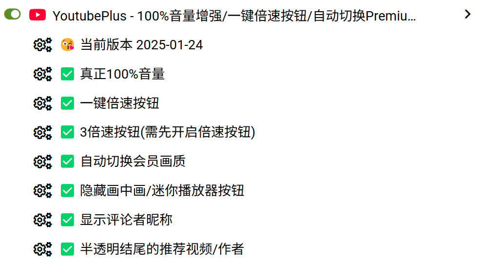
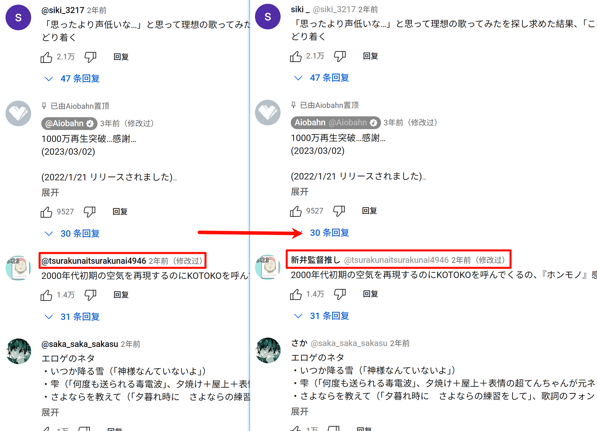
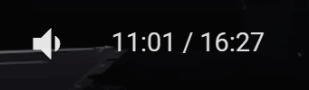
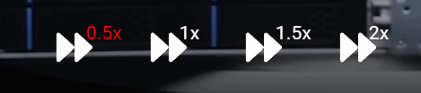
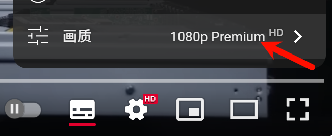

# YoutubePlus

优化Youtube的使用体验，目前实现了以下5个功能：
- 优化音量条，将音量条拖到最大时音量真正为100%(关闭了Youtube的“音量均衡”)
- 增加一键倍速按钮，不用再点好几次才能调到2倍速
- 在开通Premium时，自动切换为Premium会员画质
- 删除迷你播放器、剧场模式按钮
- 自动将评论区的 `用户名(@username)` 转为 `昵称+用户名 (nickname @username)`

以上功能均可单独开启或关闭。

# 使用
请自行百毒或者咕歌“油猴脚本如何安装”

此处是安装链接: https://greasyfork.org/zh-CN/scripts/486375

# 功能
## 评论区用户名转换

## 优化音量条

Youtube播放器的音量条拖到最大的实际音量值为优化后的结果，并不是100%。

用这个脚本可以在你将音量条拖拽到最右侧时给你开到真正百分百的音量。

（注：请谨慎使用本脚本，注意用耳健康。Youtube这样做是为了保证每个视频的音量均衡，部分视频可能并不适合使用此脚本的方法暴力提升至100%）

## 一键倍速按钮

增加了5个按钮：0.5x、1x、1.5x、2x、3x(需单独开启)，点击即可切换倍速。

## 自动切换Premium画质

开通Premium时，自动切换为Premium会员画质，不用每次手动点击

## 删除迷你播放器、剧场模式按钮

这两个废物按钮反正笔者除了误点以外一次都没点过。

# 更新日志
2025-01-24：
- 修复会员画质兼容性问题
- 修复删除迷你播放器、剧场模式按钮功能失效问题
- 增加3x倍速按钮

2025-01-19.3：
- 修复开启会员画质后加载视频后设定菜单不会消失的bug
- 增加评论区用户名转换功能

2025-01-19：
- 插件改名YoutubePlus(原名Youtube真正100%音量/Youtube-Bomb)
- 增加一键倍速按钮
- 增加删除迷你播放器、剧场模式按钮功能
- 增加自动切换为Premium会员画质功能
- 每个功能都可以单独开启、关闭

2024-05-26：
- 修复音量一大一小的问题
- 在插件激活时音量条圆点会变红